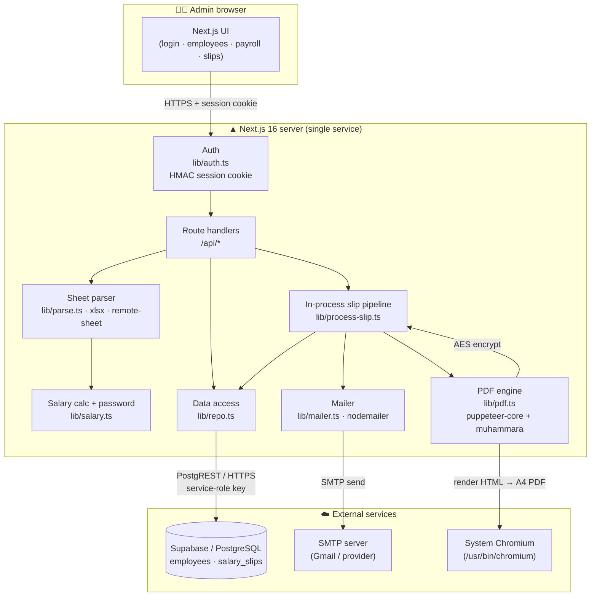
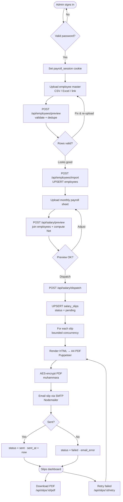
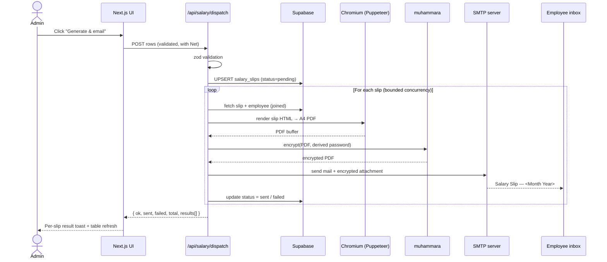
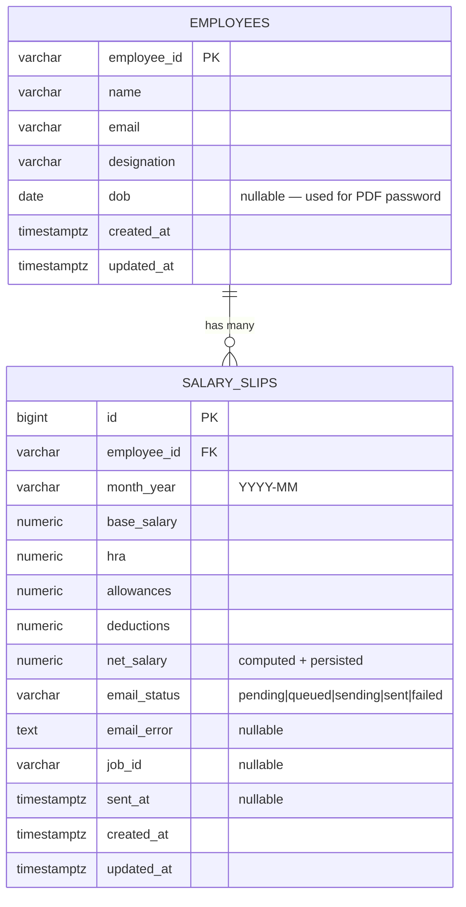

# Nippon Toyota | Payroll Portal

> Automated, password‑protected salary‑slip generation and email delivery.

Upload an employee master and a monthly payroll sheet, preview the computed
salary slips, then generate **AES‑encrypted PDF** slips and email each employee
their own slip — all from a single admin dashboard.

Built with **Next.js 16** (App Router, React 19), **Supabase** (hosted
PostgreSQL), **puppeteer‑core + @sparticuz/chromium** (PDF rendering),
**muhammara** (PDF encryption), **Nodemailer** (SMTP), **Tailwind CSS v4** and
**shadcn/ui**.

> ℹ️ **Architecture note:** This version runs as a **single web service**.
> Salary‑slip emails are processed by an **in‑process pipeline** inside the
> Next.js server — there is **no Redis, no BullMQ, and no separate worker
> process**. Data is read/written through the Supabase REST client over HTTPS.

---


## Table of contents

- [Features](#features)
- [Tech stack](#tech-stack)
- [System design](#system-design)
- [Request flow chart](#request-flow-chart)
- [Dispatch sequence](#dispatch-sequence)
- [Data model](#data-model)
- [Project structure](#project-structure)
- [Prerequisites](#prerequisites)
- [How to run (local)](#how-to-run-local)
- [Environment variables](#environment-variables)
- [Database setup](#database-setup)
- [Seeding & sample data](#seeding--sample-data)
- [API reference](#api-reference)
- [Pages](#pages)
- [PDF & password scheme](#pdf--password-scheme)
- [Email](#email)
- [Deployment](#deployment)
- [Security notes](#security-notes)
- [Troubleshooting](#troubleshooting)
- [npm scripts](#npm-scripts)

---

## Features

- **Password‑gated admin portal** — single‑password login backed by a signed,
  HTTP‑only session cookie (custom HMAC‑SHA256, no external auth dependency).
- **Employee master import** — upload `Employee ID, Name, Email, Designation,
  DOB` as **CSV / Excel**, or paste a **link** to a Google Sheet / OneDrive /
  direct file. Rows are validated and **previewed** before import (duplicate IDs,
  bad emails, and missing fields are flagged).
- **Monthly payroll run** — upload `Employee ID, Base Salary, HRA, Allowances,
  Deductions, Month/Year`. Each row is **joined** against the employee master,
  net salary is computed, and a **preview table** is shown before dispatch.
- **Net salary** — `Net = (Base + HRA + Allowances) − Deductions`, computed and
  persisted with the slip.
- **Dynamic PDF engine** — a clean, professional A4 salary slip per employee,
  rendered from a self‑contained HTML template.
- **Password‑protected PDFs** — each slip is **AES‑encrypted**. The password is
  derived from the employee's first name + birth year (with a fallback when no
  DOB is on file); the human‑readable hint is included in the email body.
- **Email delivery with status tracking** — every employee receives an HTML
  email addressing them by name and attaching their encrypted slip. Per‑slip
  delivery status (`pending → queued → sending → sent / failed`) is tracked in
  the database and shown in the dashboard, with **per‑slip PDF download** and
  **retry** for failures.
- **Health check** — the dashboard surfaces live database and SMTP status.

---

## Tech stack

| Layer | Choice |
| --- | --- |
| Framework | Next.js 16.2 (App Router) · React 19.2 · TypeScript 5 |
| UI | Tailwind CSS v4 · shadcn/ui (`base-nova`) · Base UI · lucide‑react · sonner · next‑themes |
| Database | Supabase (hosted PostgreSQL) via `@supabase/supabase-js` (PostgREST over HTTPS) |
| Auth | Custom HMAC‑SHA256 signed session cookie (`payroll_session`) |
| PDF render | `puppeteer-core` driving system Chromium, with `@sparticuz/chromium` fallback for serverless |
| PDF encrypt | `muhammara` (qpdf‑free AES encryption) |
| Email | `nodemailer` (SMTP) |
| Sheet parsing | `xlsx` (CSV/Excel), with remote‑sheet link fetching |
| Validation | `zod` |
| Runtime | Node.js 20.9+ (Docker image uses Node 22) |

---

## System design



**Key design points**

- **One process, no broker.** The "queue" is an in‑process, bounded‑concurrency
  loop inside the `dispatch` route handler — not Redis/BullMQ. This keeps
  deployment to a single container.
- **Supabase REST, not a raw socket.** The server talks to Postgres through the
  Supabase JS client over HTTPS (IPv4‑friendly), using the **service‑role key**
  (server‑only, bypasses RLS). A direct `DATABASE_URL` is used **only** for
  applying the schema with `psql`.
- **Chromium reuse.** A single headless browser is cached on `globalThis` and
  reused across requests, with ETXTBSY retry handling for freshly‑decompressed
  serverless binaries.

---

## Request flow chart

End‑to‑end flow from upload to delivered slip:



---

## Dispatch sequence



---

## Data model



- **Unique constraint** `uniq_emp_month (employee_id, month_year)` — one slip per
  employee per month (re‑dispatching upserts the existing row).
- **Indexes** on `month_year` and `email_status`.
- `updated_at` is maintained by a Postgres trigger (`set_updated_at`).
- Foreign key cascades on update/delete of an employee.

Full DDL: [`db/schema.sql`](./db/schema.sql). TypeScript shapes: [`lib/types.ts`](./lib/types.ts).

---

## Project structure

```
nippon_toyota_r2/
├─ app/
│  ├─ (admin)/                 # protected route group (requires session)
│  │  ├─ layout.tsx            # admin shell + nav
│  │  ├─ page.tsx              # dashboard (metrics + health + how-it-works)
│  │  ├─ employees/page.tsx    # upload + employee master table
│  │  ├─ payroll/page.tsx      # monthly payroll upload + preview
│  │  └─ slips/page.tsx        # slips table (status, download, retry)
│  ├─ login/page.tsx           # admin login
│  ├─ api/
│  │  ├─ auth/{login,logout}/  # session cookie set/clear
│  │  ├─ employees/            # GET list · preview · import
│  │  ├─ salary/               # preview · dispatch
│  │  ├─ slips/                # GET list · [id]/pdf · [id]/retry
│  │  └─ health/               # DB + SMTP health check
│  ├─ layout.tsx · globals.css · favicon.ico
├─ components/                 # uploaders, tables, nav, login form, ui/* (shadcn)
├─ lib/
│  ├─ auth.ts                  # session cookie create/verify
│  ├─ env.ts                   # typed env access
│  ├─ supabase.ts              # service-role Supabase client (singleton)
│  ├─ repo.ts                  # data access (employees + slips)
│  ├─ parse.ts                 # CSV/XLSX parsing + validation
│  ├─ remote-sheet.ts          # fetch sheets from a link
│  ├─ sheet-providers.ts · sheet-source.ts
│  ├─ salary.ts                # net calc + PDF password derivation
│  ├─ slip-template.ts         # salary-slip HTML template
│  ├─ pdf.ts                   # render (Puppeteer) + encrypt (muhammara)
│  ├─ mailer.ts                # Nodemailer transport + email template
│  ├─ process-slip.ts          # render → encrypt → email → status (one slip)
│  ├─ branding.ts · types.ts · utils.ts
├─ db/schema.sql               # PostgreSQL schema (apply in Supabase)
├─ scripts/seed.ts             # insert sample employees
├─ samples/                    # employees.csv · salary-2026-05.csv
├─ public/                     # logo.png (used in PDF + email)
├─ Dockerfile                  # multi-stage standalone build + Chromium
├─ render.yaml                 # Render blueprint (single web service)
├─ vercel.json                 # per-route memory/timeout for PDF routes
├─ next.config.ts              # standalone output + native-module tracing
└─ .env.example                # copy to .env.local
```

---

## Prerequisites

- **Node.js 20.9+** (the production Docker image uses Node 22)
- A **Supabase project** (free tier is fine) — provides the PostgreSQL database
- **SMTP credentials** (e.g. a Gmail account with an App Password)
- A **Chrome / Chromium** binary for PDF rendering. On Linux:
  `sudo apt-get install -y chromium` (or `google-chrome-stable`). Set
  `PUPPETEER_EXECUTABLE_PATH` if it isn't auto‑detected.

> No MySQL, Redis, or Docker is required for local development.

---

## How to run (local)

```bash
# 1. Install dependencies
npm install

# 2. Configure environment
cp .env.example .env.local
#    Fill in: SUPABASE_URL, SUPABASE_SERVICE_ROLE_KEY, ADMIN_PASSWORD,
#    SESSION_SECRET, and the SMTP_* values.

# 3. Apply the database schema (one-time, into your Supabase project)
#    Option A — Supabase dashboard: paste db/schema.sql into the SQL Editor.
#    Option B — psql with the Session-pooler URI:
#      psql "$DATABASE_URL" -f db/schema.sql

# 4. (Optional) seed a few sample employees
npm run seed

# 5. Start the dev server
npm run dev          # http://localhost:3000
```

Then open **http://localhost:3000**, sign in with `ADMIN_PASSWORD`, and:

1. **Employees** → upload `samples/employees.csv`, review the preview, import.
2. **Payroll** → upload `samples/salary-2026-05.csv`, review computed slips,
   click **Generate & email**.
3. **Slips** → watch delivery status; download any PDF or retry failures.

> **Tip:** `samples/employees.csv` ships with placeholder email addresses —
> edit them to a real inbox you control before dispatching, or no mail will
> reach you.

---

## Environment variables

Copy [`.env.example`](./.env.example) → `.env.local` and fill in:

| Variable | Required | Description |
| --- | :---: | --- |
| `SUPABASE_URL` | ✅ | Supabase project URL, e.g. `https://<ref>.supabase.co` |
| `SUPABASE_SERVICE_ROLE_KEY` | ✅ | **Server‑only** service‑role key (bypasses RLS). Never expose to the browser. |
| `SUPABASE_PUBLISHABLE_KEY` | — | Anon/publishable key (not used by the server). |
| `DATABASE_URL` | — | Direct Postgres URI — **migrations only** (`psql -f db/schema.sql`). Use the Supabase *Session pooler* URI. |
| `ADMIN_PASSWORD` | ✅ | Password for the admin dashboard. |
| `SESSION_SECRET` | ✅ | Secret used to sign the session cookie. Generate with `node -e "console.log(require('crypto').randomBytes(32).toString('hex'))"`. |
| `SMTP_HOST` | ✅ | SMTP hostname, e.g. `smtp.gmail.com`. |
| `SMTP_PORT` | — | SMTP port (default `587`). |
| `SMTP_SECURE` | — | `"true"` for port 465 (implicit TLS), `"false"` for 587 (STARTTLS). |
| `SMTP_USER` | ✅ | SMTP username / email. |
| `SMTP_PASS` | ✅ | SMTP password (use a Gmail **App Password**, not your login). |
| `SMTP_FROM` | ✅ | Sender, e.g. `"Nippon Toyota Payroll <payroll@nippon-toyota.example>"`. |
| `PUPPETEER_EXECUTABLE_PATH` | — | Path to Chrome/Chromium. Auto‑detected if blank. |
| `COMPANY_NAME` | — | Branding shown in the UI, PDFs, and emails (default `"Nippon Toyota"`). |
| `DISPATCH_CONCURRENCY` | — | Parallelism for the in‑process slip pipeline (`lib/process-slip.ts`, default `2`). |

---

## Database setup

The schema in [`db/schema.sql`](./db/schema.sql) creates two tables
(`employees`, `salary_slips`), supporting indexes, and an `updated_at` trigger.

Apply it **once** to your Supabase project:

- **Supabase dashboard** → SQL Editor → paste the file → Run, **or**
- `psql "$DATABASE_URL" -f db/schema.sql` using the *Session pooler* connection
  string (the direct `db.<ref>.supabase.co` host is IPv6‑only).

At runtime the app never opens a raw Postgres socket — it uses the Supabase REST
client with the service‑role key.

---

## Seeding & sample data

```bash
npm run seed     # inserts a handful of sample employees (scripts/seed.ts)
```

Ready‑to‑upload spreadsheets live in [`samples/`](./samples):

- `samples/employees.csv` — employee master (`Employee ID, Name, Email, Designation, DOB`)
- `samples/salary-2026-05.csv` — a monthly payroll run

Column headers are matched flexibly (case / spacing / punctuation insensitive).

---

## API reference

All routes except `auth/login` require a valid `payroll_session` cookie and
return `401` otherwise.

| Method & path | Purpose | Body / params | Returns |
| --- | --- | --- | --- |
| `POST /api/auth/login` | Sign in | `{ password }` | `{ ok }` + sets cookie |
| `POST /api/auth/logout` | Sign out | — | `{ ok }` + clears cookie |
| `GET /api/employees` | List employees | — | `{ employees[] }` |
| `POST /api/employees/preview` | Validate an upload | `FormData` `file` **or** `url` | `{ rows[], summary }` |
| `POST /api/employees/import` | Import reviewed rows | `{ rows[] }` | `{ ok, imported }` (UPSERT) |
| `POST /api/salary/preview` | Join + compute Net | `FormData` `file` **or** `url` | `{ rows[], summary }` |
| `POST /api/salary/dispatch` | Generate + email slips | `{ rows[] }` | `{ ok, sent, failed, total, results[] }` |
| `GET /api/slips` | List slips (optional `?month=`) | query `month` | `{ slips[], months[] }` |
| `GET /api/slips/[id]/pdf` | Download an encrypted slip | path `id` | `application/pdf` |
| `POST /api/slips/[id]/retry` | Re‑send a failed slip | path `id` | `{ ok }` |
| `GET /api/health` | DB + SMTP health | — | health status |

The PDF‑heavy routes (`salary/dispatch`, `slips/[id]/pdf`, `slips/[id]/retry`)
are configured in [`vercel.json`](./vercel.json) with extra memory and a
60‑second timeout.

---

## Pages

| Route | Access | Purpose |
| --- | --- | --- |
| `/login` | public | Admin sign‑in (redirects to `/` if already authenticated). |
| `/` | session | Dashboard: employee/slip/sent/pending/failed metrics + DB & SMTP health + "how it works". |
| `/employees` | session | Upload employee master (file or link) → preview → import; lists current employees. |
| `/payroll` | session | Upload a monthly payroll sheet → preview joined rows with computed Net → dispatch. |
| `/slips` | session | Filterable slip table with status, per‑slip PDF download, and retry. |

Protected pages live under the `app/(admin)` route group and call
`requireSession()`; unauthenticated visitors are redirected to `/login`.

---

## PDF & password scheme

- Slips are rendered from a self‑contained HTML template
  ([`lib/slip-template.ts`](./lib/slip-template.ts)) to **A4** via Puppeteer,
  then **AES‑encrypted** with muhammara ([`lib/pdf.ts`](./lib/pdf.ts)).
- The open password is **derived** from the employee's details
  ([`lib/salary.ts`](./lib/salary.ts)) — typically the first name (uppercased)
  plus birth year (e.g. `AARAV1992`), with a fallback when no DOB is on file.
- The **human‑readable hint** (not the password itself) is included in the email
  so employees know how to open the attachment.

---

## Email

- Sent via Nodemailer over SMTP ([`lib/mailer.ts`](./lib/mailer.ts)); the
  transport is cached as a singleton.
- Subject: `Salary Slip — <Month Year>`. The HTML body greets the employee by
  name, embeds the company logo, and shows the password hint in a callout.
- Attachment: the encrypted slip, named `salary-slip-<month_year>.pdf`.

---

## Deployment

This is a **single web service** — no Redis or worker to provision.

### Docker

The [`Dockerfile`](./Dockerfile) is a multi‑stage build producing a Next.js
**standalone** image (Node 22), with **system Chromium** and fonts installed for
PDF rendering. Native modules (muhammara and its dependency closure) are traced
into the standalone bundle via `next.config.ts`.

```bash
docker build -t nippon-payroll .
docker run --rm -p 3000:3000 --env-file .env.local nippon-payroll
```

> Local Docker note: if `docker compose` / `docker build` can't reach the
> daemon, run `docker context use default` first.

### Render

[`render.yaml`](./render.yaml) is a Render blueprint that provisions one Docker
web service (`nippon-toyota-web`), health‑checks `/`, auto‑generates
`SESSION_SECRET`, and reads the rest of the config from the `payroll-shared`
env‑var group (fill the `sync: false` values in the dashboard).

### Vercel

[`vercel.json`](./vercel.json) raises memory to 1 GB and the timeout to 60 s for
the three PDF‑generating routes. On Vercel there is no system Chrome, so the app
falls back to `@sparticuz/chromium` automatically.

---

## Security notes

- The **service‑role key bypasses RLS** and must stay server‑only — it is never
  placed in a `NEXT_PUBLIC_*` variable or used in a Client Component.
- The session cookie is **HTTP‑only**, `SameSite=Lax`, and `Secure` in
  production; the password and token signature are compared in **constant time**.
- Slip PDFs are **encrypted at rest in transit** (in the email) — recipients
  need the derived password to open them.

---

## Troubleshooting

| Symptom | Likely cause / fix |
| --- | --- |
| Login always fails | `ADMIN_PASSWORD` / `SESSION_SECRET` not set in `.env.local`. |
| "Database unreachable" on the dashboard | `SUPABASE_URL` / `SUPABASE_SERVICE_ROLE_KEY` wrong, or schema not applied. |
| Emails not arriving | Check `SMTP_*`; for Gmail use an **App Password**; verify `SMTP_SECURE`/`SMTP_PORT` match (465↔true, 587↔false). |
| PDF generation errors locally | Install Chromium and/or set `PUPPETEER_EXECUTABLE_PATH`. |
| `ETXTBSY` on first PDF (serverless) | Transient; the browser launcher retries automatically. |
| `npm run seed` mails go nowhere | Sample rows use placeholder emails — edit them first. |

---

## npm scripts

| Command | Description |
| --- | --- |
| `npm run dev` | Start the Next.js dev server (http://localhost:3000). |
| `npm run build` | Production build (standalone output). |
| `npm run start` | Run the production build. |
| `npm run lint` | ESLint. |
| `npm run seed` | Insert sample employees (`scripts/seed.ts`). |
